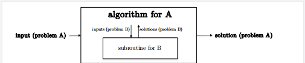
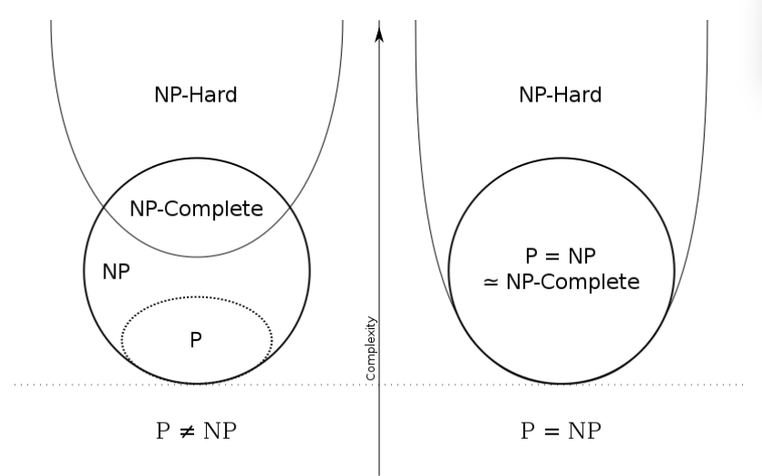

# NP-Complete定理
```
課程名稱：演算法
授課老師： 陳鍾誠
參考資料： Algorithms Illuminated (Part 4) Algorithms for NP-Hard Problems；https://ycc.idv.tw/algorithm-complexity-theory.html；https://zhuanlan.zhihu.com/p/235301347；https://zhuanlan.zhihu.com/p/433308577；
```

### 介紹這個問題之前我們先瞭解 *時間複雜度*
```
1.時間複雜度並不是表示一個程序解決問題需要花多少時間，而是當程序所處理的問題規模擴大后，程序需要的時間長度對應增長的有多快。
2.處理某個程序所處理某個特定數據的效率不能衡量該程序的好或坏，而是要等規模擴大數倍甚至數百數千萬倍，運行的時間是否和當時小規模的相似，或者有變慢數百倍數千萬倍。
3. 不管數據有多大，程序所處理時間始終花這麽長，這個程序也就是具有O(1)的時間複雜度
4.數據規模變得有多大， 花時間的也跟著變長，找個n個數字的最大值這個程序的時間複雜夫就是O(n), 為綫性級複雜函數。
5.冒泡排序和插入排序等，數據擴大2倍， 時間變慢4倍，時間複雜度就是O(n^2),為平方級別複雜度。
6.窮舉法，所需時間長度成幾何階數上漲，這就是O(a^n)指數級複雜度，甚至O(n!)。
```

#### 關於NP難問題的三個事實
1. 普遍性：與實際相關和NP難問題無處在。
2. 難處理性：在一個被廣汎數學猜想下，任何NP問題可以由任何始終認爲正確且始終運行的算法多項式時間。
3. 不是死刑：NP難題通常可以（但并不總是）在實踐中至少通過足夠的資源投資和算法複雜度。




#### 常見還原範例：
1. 求整數數組的中值可歸結為 排序數組的問題。 （排序後數組，返回中間元素。）

2. 所有對的最短路徑問題歸結為單源最短路徑問題。 （調用單個源最短路徑算灋每種可能一次輸入圖中起始頂點的選擇。）

3. 最長公共子序列問題簡化為序列比對問題。 （調用序列兩個輸入字串的對齊算法，a每插入一個空位1個罰分，以及一個非常大的罰分對於兩個不同符號的每個不匹配。）

#### 從舊算法中創造出新算法
1. 還原將MergeSort 算法轉化爲O(n log n)  時間中值查找算法，更廣汎地說，任何T(n)時間的排序算法轉化爲O(T(n)) - time 中的值查找算法。其中n是數組長度。
2. 縮減將單源最短路徑問題的任何T(m,n)時間算法轉化為 O(n-T(n))。時間算法轉化爲O(n-T(m,n))時間的全對最短路徑問題算法，其中m和n分別表示邊的數量和頂點數量。
3. 將序列排序問題的T(m,n)時間算法轉化為最長公共子序列問題的O(t(m,n))時間算法，其中，m和n表示兩個輸入字符串的長度。

##NP 問題背景

NP完備性由1971年引入。約翰·霍普克羅夫特 (John Hopcroft) 認為，NP 完全問題是否可以在多項式時間內解決的問題應該推遲到以後，因為無論如何都沒有人能夠正式證明他們的主張。並取得了與會各方的共識。。就是所謂的“是否P=NP問題”。 

### P = NP？
```
* 如果有些演算法用DTM來做計算所需時間是polynomial time, 那這些演算法或問題被稱爲P問題。
* 另外有些演算法使用NTM來做計算所需時間是polynomial time, 那這類問題被稱爲NP問題。
```
NP問題還有另一個數學上等價的判斷方法，，從驗證解的難度來界定，如果用DTM來驗證一組解是否正確只需要 polynomial time，那這個問題就是一個NP問題，剛剛子集合加總問題，我們要驗證解是否正確很簡單也很快速，我們只要把解的數字加總起來看是不是為0就可以了，所以子集合加總問題是一個NP問題，但因為這個問題的時間複雜度為 O(N×(2N))，所以它不是一個Ｐ問題。

```
Definition of NP problem:
NTM 可在 polynomial time 内解決問題 ≡ 問題的解有辦法在DTM polynomial time下被驗證
```

兩個定義爲什麽會被連接起來？因爲NTM有無窮多個分支可以使用，那我就讓每個分支去窮舉每種可能的解，再驗證每個分支的解是否正確，驗證過程只需要 polynomial time, 所以自然在NTM只需要polynomial time 就看可以將這個問題解解完 ，因此是等價的。

### NP-Complete problem
美國Stephen A. Cook提出了Cook-Levin理論，這個數學理論指出任何一個NP裡面的問題都可以在 polynomial time 內，使用DTM，將之化約成「一個布林方程式是否存在解」的問題，這個被化約的問題又稱為布爾可滿足性問題（SAT），我們稱SAT問題為NP-Complete問題。
```
滿足以下兩點 都稱之爲NP-Complete
1. [問題]本身是一個NP問題
2. 所有的NP問題都可以用DTM在 polynomial time 内化約成這個[問題]。
```
這個概念假設我證明了SAT 是P問題 就等於今天我隨便拿到一個NP 問題就可以在polynomial time 內把問題轉換成SAT，然後再用 polynomial time 把SAT解掉，所以所有的NP問題都只是P問題了，也就是P=NP，因此NP-Complete問題就是解決 P=NP 的關鍵，如果可以證明NP-Complete問題為P問題，就可以間接證明P=NP。

### NP-Complete(NPC)
需滿足兩個條件：
1. 這是一個 NP 問題
2. 所有屬於NP問題都可以規約成它
換而言之，只要解決這個問題，所有的NP問題都解決了。

*可歸約*: 將一個問題轉化成另一個問題，使用第二個問題的解來解第一個問題，這種思想類似於數學證明中， 如果一個證明，很難從原題切入，此時根據原命題與其逆否命題是等價的，將得到及其簡便的解法或是結題切入點。
歸化具有傳遞性。也就是説問題A可以歸化成問題B，B可以歸化成C，A一定可以歸化C。

### NP-Hard問題
NP-Hard 問題即滿足NPC問題的第二個條件但不一定滿足第一個條件，因此NP-Hard問題要比NPC問題更範圍廣闊，NP-Hard問題不一定是NP問題。

#### 結序
左圖為假設 P≠NP被證明的情形，NP-Hard有兩個部分，一個部分它同時是個NP問題，另外一部分則不是，所謂的NP問題就是可以用NTM在 polynomial time內給解掉的問題，另外其解的驗證必定能用DTM在 polynomial time內完成，兩種定義是等價的，有一部分的NP問題是屬於P問題，這些問題大部分都是易解的，有另外一部分的NP問題為NP-Complete問題。

右圖是假設P＝NP被證明的情形，此時NP-Complete問題已經被證明為P問題，利用NP-Complete問題的特性，我們可以化約所有NP問題為NP-Complete問題，在把這個NP-Complete問題用 polynomial time 解掉，所以P=NP=NP-Complete。




